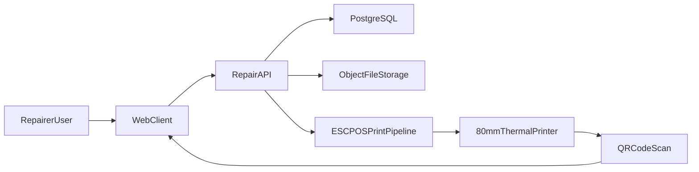

# Architecture Overview

## Core Flows

## Security and Access Control

- Users authenticate with username/password.
- Passwords are stored as bcrypt hashes.
- API issues signed JWT tokens.
- RBAC permissions:
  - `repairs:view_all`
  - `repairs:assign`
  - `repairs:create`
  - `repairs:update`
  - `repairs:print`
- Default list scope is `my` repairs (`assignedToUserId = currentUser`).
- Full list and assignment actions require explicit permissions.

## Data Model Summary

- `users`, `roles`, `user_roles`
- `repairs` with `publicRef` and `assignedToUserId`
- `repair_photos` for file metadata
- `repair_status_history`
- `repair_assignment_history`
- `printer_profiles`
- `print_logs`

## Photo Strategy

- Binary files live in object/file storage.
- Database holds metadata (`storageKey`, MIME type, checksum, original filename).
- Retrieval is permission-checked before file delivery.

## Label Strategy

- Label width is constrained to 80mm-compatible character line lengths.
- QR links to `/repairs/{publicRef}`.
- Pre-fill behavior:
  - fields are printed when known,
  - blank values stay blank for manual handwriting.
- Print logs capture who printed and payload size.
